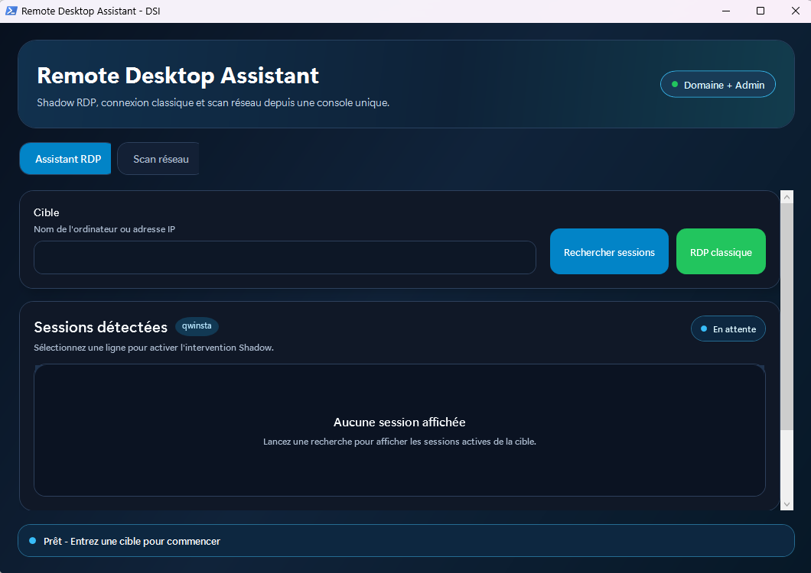
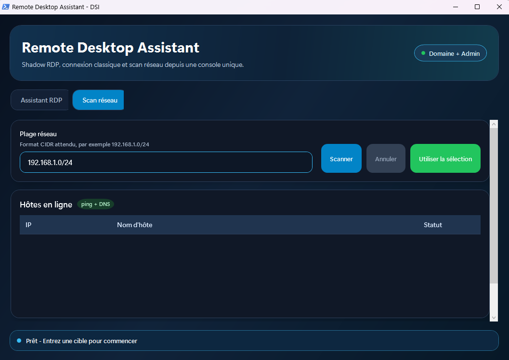

<div align="center">



<br/><br/>

# ShadowRDP

Toolkit PowerShell pour l'**assistance RDP Shadow** et le **déploiement GPO**  
en environnement Active Directory Windows.

<br/>

[](#prerequis)
[](#prerequis)
[](#fonctionnalites)
[](#demarrage-rapide)

<br/>

[**Démarrage rapide**](#demarrage-rapide) · [**Fonctionnalités**](#fonctionnalites) · [**EDR & Sécurité**](#edr-et-faux-positifs) · [**Déploiement GPO**](GPO-DEPLOYMENT.md)

</div>

---

> [!CAUTION]
> Ce toolkit est destiné **uniquement** à l'administration légitime, au support utilisateur autorisé et à la maintenance d'un parc maîtrisé. Informer les utilisateurs lors de toute prise en main distante — surtout en mode Shadow sans consentement. En cas de doute, valider avec le RSSI avant déploiement.
>
> **Dérives à éviter :** surveillance discrète, déploiement hors cadre DSI, pare-feu trop permissif, usage à des fins offensives.

---

## Aperçu visuel

<p align="center">
  
  &nbsp;
  
</p>

---

## Fonctionnalités

<table>
<tr>
<td valign="top" width="50%">

**Assistant opérateur**

- RDP Shadow : visualisation, contrôle, no-consent
- Double-clic sur une session → Shadow immédiat
- Lancement RDP classique en un clic
- Badge `DOMAINE\utilisateur` dynamique
- Tri des colonnes dans les tableaux
- Audit log opérateur automatique

</td>
<td valign="top" width="50%">

**Scan réseau CIDR**

- 16 pings async en parallèle — /24 en ~16 s
- Résultats affichés en temps réel
- Export CSV via boîte de dialogue native
- Bascule automatique vers l'onglet Assistant
- Touche Entrée sur le champ CIDR

</td>
</tr>
<tr>
<td valign="top">

**Déploiement GPO**

- Script idempotent avec marqueur de version
- Wrapper `.cmd` gérant l'élévation admin
- Mode audit `-WhatIf` et retrait `-Uninstall`
- WinRM optionnel via `-EnableWinRM`
- Pas de redémarrage `TermService` par défaut

</td>
<td valign="top">

**Sécurité & traçabilité**

- Élévation portée par `cmd.exe`, pas par PowerShell
- Audit log dans `C:\Windows\Logs\` (opérateur + cible)
- Batch ICMP limité pour compatibilité EDR
- Signature Authenticode recommandée
- Section [EDR dédiée](#edr-et-faux-positifs)

</td>
</tr>
</table>

---

## Vue d'ensemble

| Module | Fichier principal | Objectif |
|---|---|---|
| Assistant opérateur | `RemoteDesktopAssistant.cmd` → `RemoteDesktopAssistantV1.4.ps1` | UI : sessions Shadow + scan réseau |
| Déploiement GPO | `Deploy-RDPGPO-Startup.cmd` → `Deploy-RDPGPO.ps1` | Configure RDP, Shadow, RemoteRegistry et pare-feu |

<details>
<summary><strong>Arborescence du projet</strong></summary>

```text
ShadowRDP/
├── RemoteDesktopAssistant.cmd          ← lanceur (élévation + appel du .ps1)
├── RemoteDesktopAssistantV1.4.ps1
├── Deploy-RDPGPO-Startup.cmd
├── Deploy-RDPGPO.ps1
├── GPO-DEPLOYMENT.md
├── README.md
└── _OLD/
```

</details>

---

## Démarrage rapide

> [!TIP]
> Utilisez le wrapper CMD — l'élévation est portée par `cmd.exe` et non par PowerShell, ce qui réduit les faux positifs EDR.

### Assistant opérateur

```text
RemoteDesktopAssistant.cmd   ← double-cliquer (élévation gérée par le wrapper)
```

Ou directement :

```powershell
powershell -ExecutionPolicy Bypass -File .\RemoteDesktopAssistantV1.4.ps1
```

### Déploiement manuel (admin)

```powershell
powershell -ExecutionPolicy Bypass -File .\Deploy-RDPGPO.ps1 -MaxAgeDays 0
```

### Audit sans modification

```powershell
powershell -ExecutionPolicy Bypass -File .\Deploy-RDPGPO.ps1 -WhatIf -MaxAgeDays 0
```

### Retrait de la configuration

```powershell
powershell -ExecutionPolicy Bypass -File .\Deploy-RDPGPO.ps1 -Uninstall
```

### Activation WinRM (optionnel)

```powershell
powershell -ExecutionPolicy Bypass -File .\Deploy-RDPGPO.ps1 -EnableWinRM -MaxAgeDays 0
```

---

## Déploiement GPO Startup

Dans la GPO, référencer le wrapper :

```text
Configuration ordinateur > Stratégies > Paramètres Windows > Scripts > Démarrage
→ Deploy-RDPGPO-Startup.cmd
```

Le wrapper lance PowerShell en `-NoProfile -NonInteractive -ExecutionPolicy Bypass` et appelle `Deploy-RDPGPO.ps1` dans le même dossier.

<details>
<summary><strong>Paramètres par défaut du wrapper</strong></summary>

| Paramètre | Valeur par défaut |
|---|---|
| `ShadowMode` | `2` |
| `AllowedRemoteAddresses` | `LocalSubnet` |
| `NetworkWaitTimeoutSeconds` | `0` |
| `MaxAgeDays` | `7` |
| Redémarrage `TermService` | Non |
| Activation WinRM | Non |

</details>

<details>
<summary><strong>Codes retour</strong></summary>

| Code | Signification |
|---|---|
| `0` | Succès |
| `1` | Erreur critique |
| `2` | Droits insuffisants |

</details>

Documentation détaillée : [`GPO-DEPLOYMENT.md`](GPO-DEPLOYMENT.md)

---

## Compatibilité Assistant ↔ Déploiement

`Deploy-RDPGPO.ps1` prépare les postes cibles pour les appels de `RemoteDesktopAssistantV1.4.ps1`.

| Fonction client | Prérequis cible configuré |
|---|---|
| Ping / scan réseau | Règle pare-feu `FPS-ICMP4-ERQ-In*` |
| `qwinsta.exe /server:<poste>` | `RemoteRegistry` démarré + règles `RemoteSvc*`, `RemoteEventLog*`, `WMI-*`, `FPS-SMB-In*` |
| `mstsc.exe /v:<poste>` | RDP activé + règles `RemoteDesktop-*` |
| `mstsc.exe /shadow /noConsentPrompt` | `AllowRemoteRPC=1` + policy `Shadow=2` par défaut |

> [!NOTE]
> WinRM n'est pas requis par l'application et reste désactivé par défaut.

---

## Scan réseau CIDR

Le champ scan accepte plusieurs formats :

| Saisie | Interprété comme |
|---|---|
| `192.168.1.0/24` | Plage exacte |
| `192.168.1.0` | Auto-converti en `/24` |
| `192.168.1` | Auto-converti en `192.168.1.0/24` |
| `172.16.5.0/26` | Plage exacte |

**Comportement :**

- **16 pings asynchrones en parallèle** — un /24 se complète en ~16 s
- Fenêtre réactive — scan non bloquant via `DispatcherTimer` + `PingAsync`
- Hôtes en ligne affichés **en temps réel** dans le tableau
- `Annuler` interrompt proprement le scan et libère les ressources
- `Exporter CSV` sauvegarde les résultats via une boîte de dialogue native
- `Utiliser la sélection` copie l'IP et bascule automatiquement vers l'onglet Assistant
- Erreurs journalisées dans `%TEMP%\RemoteDesktopAssistant-scan.log`

---

## EDR et faux positifs

> [!WARNING]
> Ce toolkit manipule des primitives surveillées par les EDR (RDP shadow, énumération de sessions distantes, scan réseau). Des alertes sont possibles selon la politique de l'EDR. Les mesures ci-dessous réduisent significativement l'exposition.

### Signaux déclencheurs connus

| Signal | Règle type | Mitigation |
|---|---|---|
| `powershell.exe` se re-spawn avec `-Verb RunAs` | `proc_creation_win_powershell_privilege_escalation` | Utiliser `RemoteDesktopAssistant.cmd` — élévation portée par `cmd.exe` |
| `-ExecutionPolicy Bypass` dans les args d'un processus enfant | `proc_creation_win_powershell_exec_bypass` | Idem — le Bypass reste dans le `.cmd`, pas dans le `.ps1` |
| Pings ICMP en masse | `net_connection_win_susp_mass_icmp` | Batch limité à 16 — réduire via `$Script:NetworkScanBatchSize` si besoin |
| `qwinsta.exe /server:<remote>` | `proc_creation_win_qwinsta_remote` | Inhérent — justifié par le contexte support |
| `mstsc.exe /shadow /noConsentPrompt` | `proc_creation_win_mstsc_shadow_noconsent` | Inhérent — à whitelister après validation RSSI |
| Script PS non signé + Bypass | Heuristique générique | **Signer le script** avec le CA interne (voir ci-dessous) |

### Signature Authenticode (recommandé)

Signer le script avec un certificat de la PKI interne élimine les alertes heuristiques :

```powershell
# Récupérer le certificat de signature de code (PKI interne)
$cert = Get-ChildItem Cert:\CurrentUser\My -CodeSigningCert | Select-Object -First 1

# Signer
Set-AuthenticodeSignature -FilePath .\RemoteDesktopAssistantV1.4.ps1 `
    -Certificate $cert `
    -TimestampServer "http://timestamp.votredomaine.local"

# Vérifier
Get-AuthenticodeSignature .\RemoteDesktopAssistantV1.4.ps1
```

Une fois signé, remplacer `Bypass` par `AllSigned` dans le wrapper.

### Audit log opérateur

Chaque action sensible est journalisée dans `C:\Windows\Logs\RemoteDesktopAssistant-audit.log` :

```
2026-05-02 14:23:11 | DOMAINE\jdupont | PC-SUPPORT | DEMARRAGE        |
2026-05-02 14:23:18 | DOMAINE\jdupont | PC-SUPPORT | SESSIONS_ENUM    | 192.168.1.45
2026-05-02 14:23:21 | DOMAINE\jdupont | PC-SUPPORT | SHADOW_NoConsent | 192.168.1.45 (SessionID=2, Utilisateur=jmartin)
```

Ce log constitue la preuve d'usage légitime lors d'une investigation SOC.

### Exclusion HarfangLab

Après signature et validation RSSI, ajouter une exclusion dans la console HarfangLab (**Politique > Exclusions > Processus**) basée sur le hash SHA-256 ou la signature Authenticode :

```powershell
Get-FileHash .\RemoteDesktopAssistantV1.4.ps1 -Algorithm SHA256
```

---

## Prérequis

- Windows PowerShell 5.1+
- Droits administrateur local
- Exécution conseillée en PowerShell 64 bits
- Contexte AD/GPO selon votre organisation
- Windows 10 / 11 / Windows Server avec module `NetSecurity`

---

## Tests et vérifications

### Validation syntaxe PowerShell

```powershell
$tokens = $null; $errors = $null
[void][System.Management.Automation.Language.Parser]::ParseFile(
    (Resolve-Path .\RemoteDesktopAssistantV1.4.ps1), [ref]$tokens, [ref]$errors
)
$errors
```

### Vérifications post-déploiement (poste cible)

```powershell
Get-ItemProperty 'HKLM:\SOFTWARE\GrandEst\CMIL\RDPShadowDeploy'
Get-Service RemoteRegistry, TermService
Get-NetFirewallRule -Name 'RemoteDesktop-*','RemoteSvc*','FPS-ICMP4-ERQ-In*','FPS-SMB-In*' -ErrorAction SilentlyContinue
```

---

## Bonnes pratiques

- Tester en préproduction avant diffusion large
- Limiter les ouvertures pare-feu au strict nécessaire
- Journaliser les exécutions en environnement de prod
- Préférer les GPO natives pour les paramètres stables (RDP, NLA, firewall)
- Garder le script pour l'idempotence, les écarts de parc et l'observabilité
